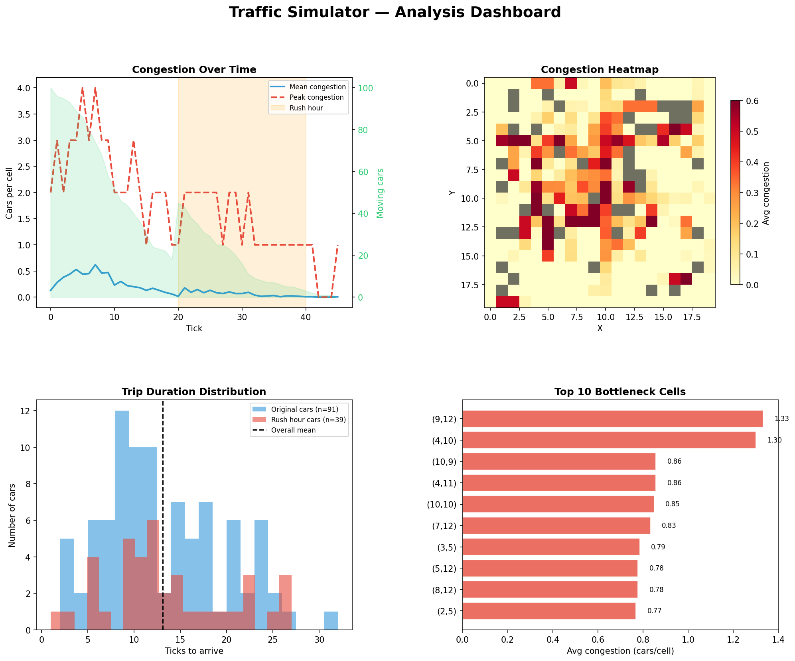
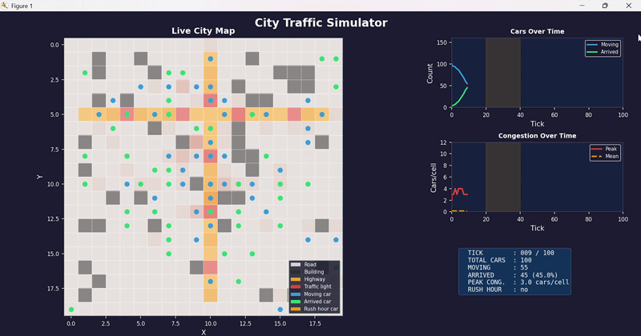

# 🚦 City Traffic Simulator

A data-driven city traffic simulator built entirely with **NumPy**, **Pandas**, and **Matplotlib** — no game engines, no simulation frameworks. Just Python and a solid understanding of how to model complex systems with arrays and DataFrames.





---

## What It Does

The simulator models a procedurally generated city as a grid where 100+ car agents navigate from random origins to random destinations. Cars route intelligently around congestion using **Dijkstra's algorithm** applied to a live cost grid. A rush hour event injects extra cars mid-simulation, creating emergent traffic jams that resolve organically as cars reroute.

The full simulation history is logged as a Pandas DataFrame and analyzed in a 4-panel dashboard that answers real questions about the traffic network — where the bottlenecks are, how rush hour impacted trip times, and which intersections are most dangerous.

---

## Key Features

- **Procedural city generation** — roads, buildings, highways, and traffic light intersections generated with NumPy
- **Agent-based car simulation** — every car is a row in a Pandas DataFrame, updated with vectorized operations each tick (no Python loops over individual cars)
- **Dijkstra pathfinding on a live cost grid** — congestion raises cell costs so cars naturally reroute around traffic jams
- **Rush hour simulation** — extra cars injected mid-simulation to stress-test the network
- **Full history logging** — every tick's state captured as a Pandas snapshot for post-simulation analysis
- **4-panel analysis dashboard** — congestion over time, spatial heatmap, trip duration distributions, bottleneck ranking
- **Live animation** — real-time Matplotlib animation with a dark-themed city map and live-updating stats panels

---

## Project Architecture

```
traffic_simulator/
│
├── city.py           → NumPy grid generation (roads, buildings, highways)
├── cars.py           → Car agents as a Pandas DataFrame + vectorized movement
├── pathfinding.py    → Dijkstra on a congestion-weighted cost grid
├── simulation.py     → Main engine: tick loop, rush hour, history logging
├── analysis.py       → Post-simulation Pandas analysis + dashboard
└── visualize.py      → Live Matplotlib animation
```

Each module has a single responsibility and can be run independently. The data flows in one direction — `city` → `cars` → `pathfinding` → `simulation` → `analysis` / `visualize` — which keeps the codebase easy to follow and extend.

---

## Technical Highlights

### NumPy — vectorized simulation state

The city grid is a 2D NumPy array where each cell holds a terrain type. All spatial operations — building congestion maps, applying cost penalties, checking cell types — are done with NumPy boolean masks and `np.add.at()` rather than Python loops:

```python
# Count cars per cell without looping over individual cars
congestion = np.zeros((grid_size, grid_size), dtype=np.float32)
np.add.at(congestion, (ys, xs), 1)
```

### Pandas — agents as a DataFrame

Every car is a row. Every tick, the entire fleet is updated in-place using vectorized column operations, boolean indexing, and `.loc[]` masking:

```python
# Move all cars and mark arrivals — no for loop
cars.loc[moving, 'distance_to_dest'] = (
    (cars.loc[moving, 'dest_x'] - cars.loc[moving, 'x']).abs() +
    (cars.loc[moving, 'dest_y'] - cars.loc[moving, 'y']).abs()
)
just_arrived = moving & (cars['distance_to_dest'] == 0)
cars.loc[just_arrived, 'status'] = 'arrived'
```

The simulation history — hundreds of thousands of rows — is built by concatenating per-tick snapshots and then analyzed with chained `groupby().agg()` pipelines.

### Dijkstra's Algorithm — congestion-aware routing

Cars don't take the shortest path — they take the **cheapest** path. Cell costs combine terrain type (highways are cheaper, traffic lights cost more) with live congestion (each car on a cell adds 0.5 to its cost). This means paths are recalculated every 5 ticks as the congestion landscape shifts:

```python
BASE_COSTS = {
    ROAD:          1.0,
    HIGHWAY:       0.5,   # twice as attractive
    TRAFFIC_LIGHT: 1.5,   # slight intersection penalty
    BUILDING:      np.inf # impassable
}

cost_grid = base_terrain_cost + (congestion_map * 0.5)
```

The result is emergent behavior — bottlenecks form at intersections, cars flood highways, and rush hour creates ripple effects that take several ticks to clear.

---

## Installation

```bash
git clone https://github.com/csb24006-blip/traffic-simulator
cd traffic-simulator
pip install numpy pandas matplotlib
```

---

## Usage

Run each stage independently or in sequence:

```bash
# Generate and visualize the city grid
python city.py

# Test car spawning and basic movement
python cars.py

# Test Dijkstra pathfinding
python pathfinding.py

# Run the full simulation and save history to CSV
python simulation.py

# Analyze the saved simulation data
python analysis.py

# Launch the live animation
python visualize.py
```

---

## Animation Controls

| Setting | Location | Effect |
|---|---|---|
| `INTERVAL_MS` | `visualize.py` | Frame speed — lower is faster |
| `MAX_TICKS` | `visualize.py` / `simulation.py` | How long the simulation runs |
| `RUSH_HOUR` | `visualize.py` | Which tick triggers rush hour |
| `GRID_SIZE` | `city.py` | City dimensions (default 20×20) |
| `NUM_CARS` | `cars.py` | Starting car count (default 100) |

---

## What the Analysis Dashboard Shows

| Panel | Question answered |
|---|---|
| Congestion over time | When did traffic peak? Did rush hour cause a visible spike? |
| Spatial heatmap | Which intersections are chronic bottlenecks? |
| Trip duration histogram | How long do most journeys take? Are rush hour cars slower? |
| Top 10 bottleneck cells | Which exact grid coordinates deserve a flyover? |

---

## Built With

- [NumPy](https://numpy.org/) — grid state, vectorized math, spatial operations
- [Pandas](https://pandas.pydata.org/) — agent management, history logging, analysis pipelines
- [Matplotlib](https://matplotlib.org/) — static visualization, analysis dashboard, live animation


